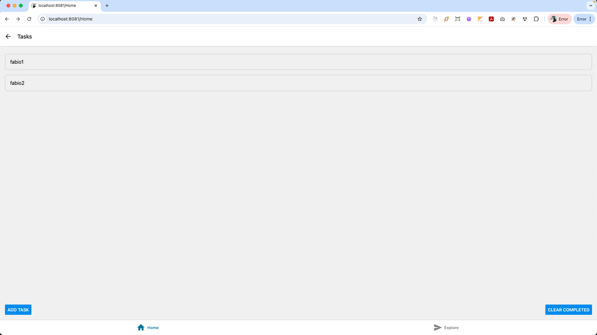
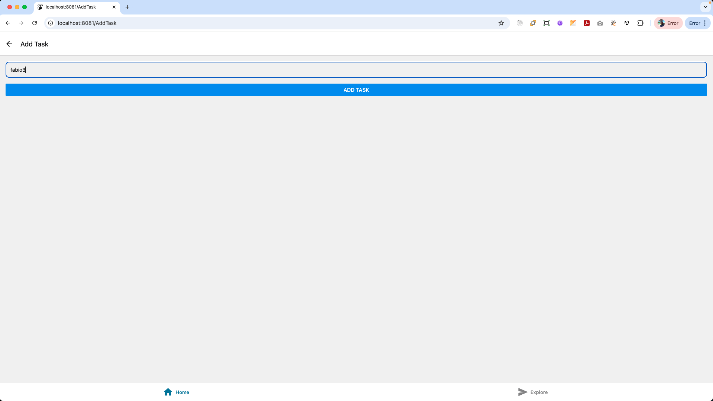
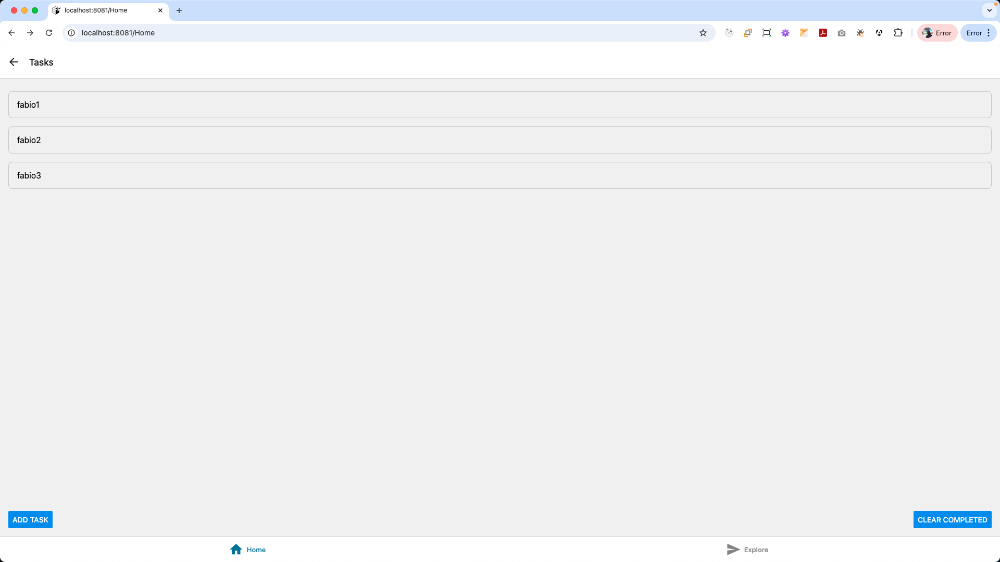
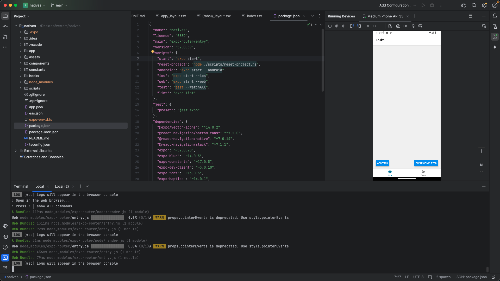

# Teste para o perfil Dev - Frontend:

<a href="https://github.com/fr-ferreira/vertem">Link para o Projeto</a>

Título do teste: Desenvolvimento de um aplicativo CRUD 0 cadastrro de tarefas.

Descrição: O objetivo deste teste é avaliar as habilidades do candidato no desenvolvimento de um aplicativo de gerenciamento de tarefas utilizando React Native.

# Instalação

Deve ser instalado na maquina o NodeJS - <a href="https://nodejs.org/en/download">NodeJS</a>

Deve ser instalado na maquina o React Native - npx create-expo-app@latest

Observação: Produzido em React native, para funcionar deve rodar na mesma versão.

# Rodar a aplicação

use para instalar o projeto:

 ```bash
    npm install
```

use para iniciar o Projeto:

   ```bash
    npx expo start
   ```

# Imagens do Projeto (CRUD)









